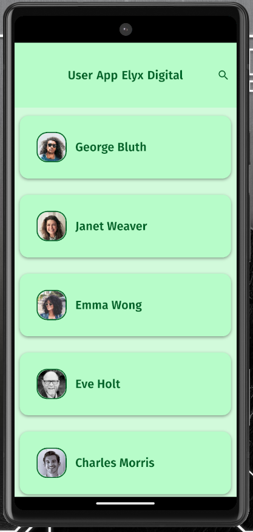
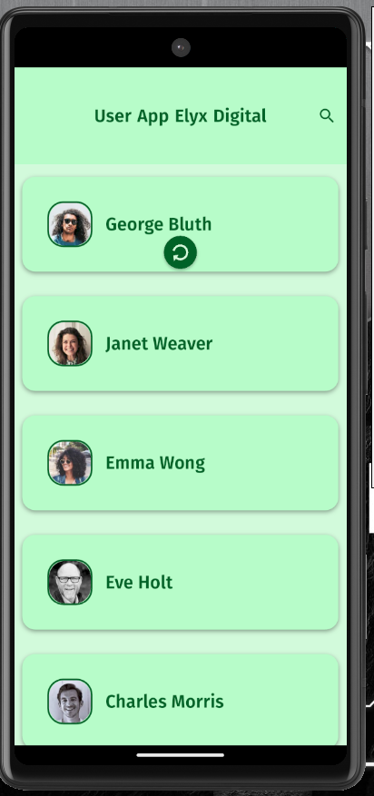
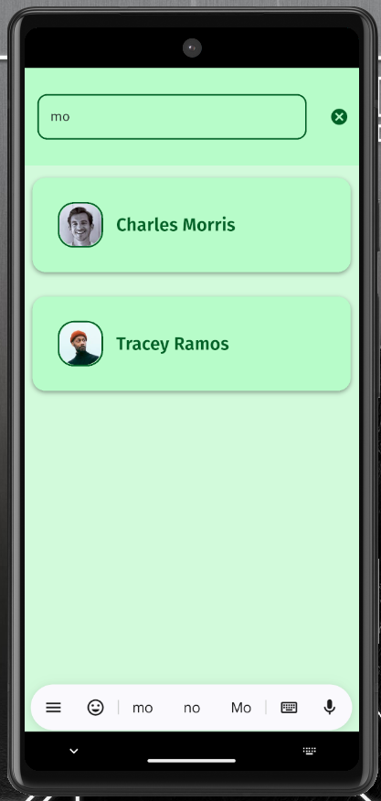

# elyx_digital_user_app

## Overview
This is a new flutter application that fetches and displays a list of users from a public API -> "https://reqres.in/api/users". This code uses the free api key provided in documentation of [Regres](https://reqres.in). This app includes following features:

 + Home Screen which has List of Users with name and profile picture.
 + Search Box is also provided to type and search for specific user.
 + Detail Screen where single user details are displayed. The api currently has first name, last name, email and avatar as user data.
 + Upon scrolling, more data is fetched.
 + Upon pulling the screen, data will be refreshed.
 + Minimal, clean and modern looking UI with colors resembling Elyx Digital.


## Versions

```bash
flutter: 3.35.6

dart:  3.9.2
```


## How to run app

```bash
flutter pub get

flutter run or Hit F5 on vscode
```


## Technical Talks
 This project follows a Feature-Based folder structure promoting clean architecture and ensuring readability and scalability.

 For State Management, BLoc is implemented using flutter_bloc package.

 For Networking, http package is used to write API related methods.

 For Caching data, shared_preference package is used to cache the loaded data. outdated cache and refresh is also handled in the code.

 For scenarios like slow api response, empty response, no internet or request timeout, app will provide with appropiate message to guide the users.

 For UI, google_fonts for typography, media query for responsiveness and neat spacing for clean modern UI is implemented.


## App Screenshots 







